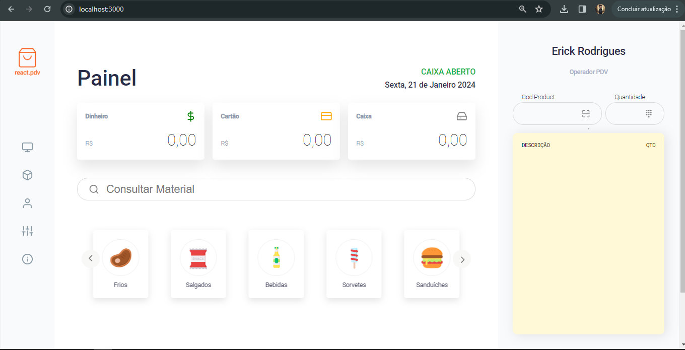

<h1 align="center">
	
</h1>

<h3 align="center">
  React PDV
</h3>

<p align="center">POS (Point of Sale System) built with ReactJS</p>

<p align="center">
  

  

  <a href="https://github.com/eryckdevops/PDVReact/commits/master">
    
  </a>

  <a href="https://github.com/eryckdevops/PDVReact/issues">
    
  </a>

  
</p>

<p align="center">
  <a href="#-about-the-project">About the project</a>&nbsp;&nbsp;&nbsp;|&nbsp;&nbsp;&nbsp;
  <a href="#-technologies">Technologies</a>&nbsp;&nbsp;&nbsp;|&nbsp;&nbsp;&nbsp;
  <a href="#-getting-started">Getting started</a>&nbsp;&nbsp;&nbsp;|&nbsp;&nbsp;&nbsp;
  <a href="#-how-to-contribute">How to contribute</a>&nbsp;&nbsp;&nbsp;|&nbsp;&nbsp;&nbsp;
  <a href="#-license">License</a>
</p>

## 👨🏻‍💻 About the project

- <p style="color: red;">POS (Point of Sale System) built with ReactJS</p>


<h1 align="center">
	
</h1>

## 🚀 Technologies

> Technologies that I used to develop this web client


<div style="display: flex; justify-content: space-between;">
    
    
    
</div>


## 💻 Getting started

### Requirements

**Clone the project and access the folder**

```bash
$ git clone  https://github.com/eryckdevops/PDVReact.git && cd PDVReact
```

**Follow the steps below**

```bash
# Install the dependencies
$ yarn

# Be sure the file 'src/services/api.ts' have the IP to your API

# Start the client
$ yarn start
```

## 🤔 How to contribute

**Make a fork of this repository**

```bash
# Fork using GitHub official command line
# If you don't have the GitHub CLI, use the web site to do that.

$ gh repo fork eryckdevops/PDVReact
```

**Follow the steps below**

```bash
# Clone your fork
$ git clone your-fork-url && cd PDVReact

# Create a branch with your feature
$ git checkout -b my-feature

# Make the commit with your changes
$ git commit -m 'feat: My new feature'

# Send the code to your remote branch
$ git push origin my-feature
```
### Front


## 🤝 Desenvolvedor

> Software Engineer

<table align="center">
  <tr>
    <td align="center">
      <a href="">
        <br>
        <sub>
          <b>Erick Rodrigues</b>
        </sub>
      </a>
    </td>
  </tr>
</table>


## 📝 Licença

Este projeto está sob licença. Consulte o arquivo [LICENSE](LICENSE) para obter mais detalhes.

&#xa0;


<a href="#top">Volte para o topo</a>